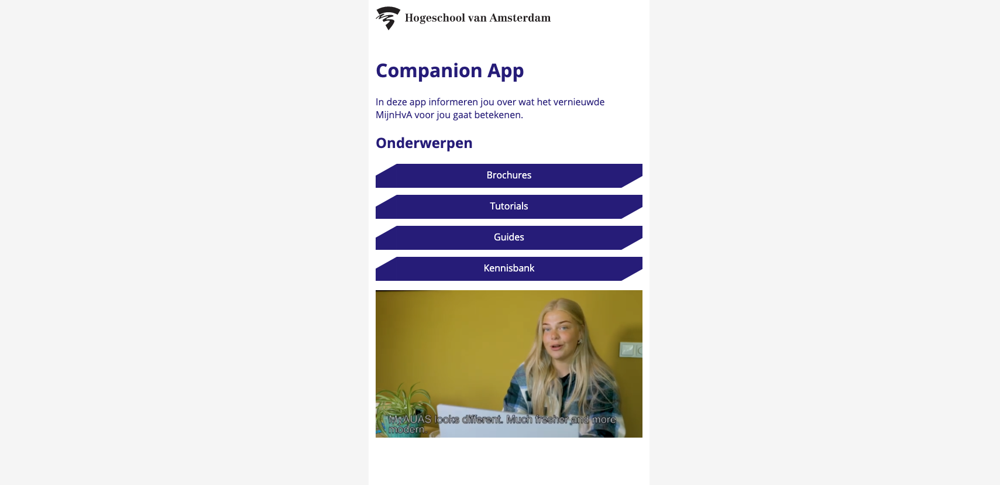

> _Fork_ deze leertaak en ga aan de slag. Onderstaande outline ga je gedurende deze taak in jouw eigen GitHub omgeving uitwerken. De instructie vind je, zoals altijd, in: [docs/INSTRUCTIONS.md](docs/INSTRUCTIONS.md)

# Companion App Start (Voorbeeld)

## Beschrijving

Je leert een debriefing schrijven...

Je leert kijken naar een huisstijl...

Je bestudeert een uitgewerkte welkompagina van de Companion App en bekijkt daarbinnen de semantiek in de HTML, de opmaak in CSS en de functionaliteit in Javascript.

  

## Antwoord op de vragen
Geef hier verhalend antwoord op de vragen uit de opdracht (docs/INSTRUCTIONS.md)!
