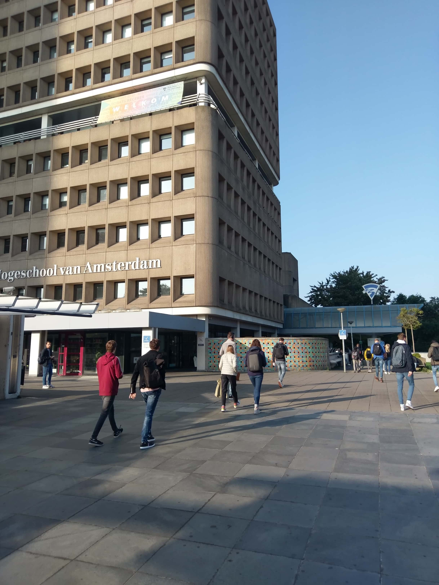

> _Fork_ deze leertaak en ga aan de slag. Onderstaande outline ga je gedurende deze taak in jouw eigen GitHub omgeving uitwerken. De instructie vind je, zoals altijd, in: [docs/INSTRUCTIONS.md](docs/INSTRUCTIONS.md)


_Voorbeeld Readme voor deze leertaak:_


# Contactpagina FDND 

Voor (nieuwe) studenten, colllega's en opdrachtgevers heeft FDND een contactpagina met de contactgegevens zoals een email-adres en telefoonnummer, en een routebeschrijving naar het leslokaal. 

## Beschrijving


Op de pagina staat een duidelijk header met een titel en beschrijving: "Hier staan de contactgegevens en routebeschrijving van de opleiding Frontend Design & Development (FDND). FDND is een HBO Ad opleiding aan de Hogeschool van Amsterdam."

In de beschrijving staan links naar de twee onderdelen van de pagina: _contactgegevens_ en _routebeschrijving_. Als je op de link klikt ga je met een animatie naar dat onderdeel van de pagina. Of je kan scrollen. 

Hier staat de website: https://fdnd-task.github.io/fdnd-contact-microsite-example/

### contactgegevens

In het onderdeel _contactgegevens_ staat het telefoonnummer en email-adres van het onderwijsbureau, en de adresgegevens van de opleiding. 

### routebeschrijving

In het onderdeel _routebeschrijving_ wordt met behulp van foto's getoond hoe een bezoeker vanaf station Amstel bij het lokaal kan komen. Als iemand voor het eerst in het gebouw de Leeuwenburg komt is dat nogal een doolhof. Daarom is de routebeschrijving met behulp van foto's stap-voor-stap uitgelegd. Een bezoeker kan met een mobiel in de hand in 9 stappen bij het lokaal komen.Bij elke foto staat een duidelijke beschrijving en is te zien welke stap van de 9 het is. 


## Kenmerken

De website is gebouwd met [HTML](#html) en [CSS](#CSS).

### HTML

Hieronder staat de basis structuur uitgelegd met de setting in de [HEAD](#HEAD) en opmaak van de [BODY](#BODY):

#### HEAD
  In de head staan de meta-settings zoals 
  `<meta name="viewport" content="width=device-width,initial-scale=1">`
  
  In de `<head>` worden twee CSS file geladen. De algemene styleguide met basis settings en kleuren. 
  En een local CSS file met specifieke styling voor deze pagina. 
  ```html
      <link rel="stylesheet" href="https://styleguide.fdnd.nl/fdnd.css">
      <link rel="stylesheet" href="styles/local.css">
  ```

  In de `<head>` wordt een extern font geladen: De Open Sans 
  
  ```
  <link href="https://fonts.googleapis.com/css2?family=Open+Sans:ital,wght@0,300;0,400;0,700;1,300;1,400&amp;display=swap" rel="stylesheet">
  ```

#### BODY

  De structuur van de body is [HEADER](#HEADER), [MAIN](#MAIN) en [FOOTER](#FOOTER): 
  
  ##### HEADER
  In de header staat de H1 titel en eerste paragraaf. In de eerste paragraaf wordt gellinkt naar de contactgegevens en routebeschrijving.
  
  ##### MAIN
  In de main staan twee sections, de section contactgegevens met een id en een section voor de routebeschrijving met een id. De id's worden gebruikt om vanuit de eerste paragraaf te linken. 
 ```html
      <section id="contactgegevens">

      <section id="routebeschrijving">
  ```
  
  De foto's voor de routebeschrijving zijn opgemaakt met een figure-element en figcaption:
  ```html
      <figure>
        
        <figcaption>Dit is de Leeuwenburg (LWB). (1/9)</figcaption>
      </figure>
  ```
  ##### FOOTER
  
  In de `<footer>` staan alle microsites van FDND. 
  
  
### CSS

In de CSS staat een `scroll-behavior: smooth;` op de html voor een animatie als iemand op de links contactgegevens en routebeschrijving klikt. Dit zijn anchors naar de sections met de id. 

#### Font-size

De `<h1>` font-size staat op 2.4em en line-height van 120%. 
De `<section>` font-size staat op 1.2em .

In de CSS zijn 3 minor breakpoints voor Small-screens:

#### @media 20em

Minor breakpoint met o.a. een aangepaste `<h1>` font-size van 1.4em, omdat de titel anders te breed is voor een small-screen.

#### @media 25em

Minor breakpoint met een aangepaste `<h1>` font-size van 1.6em, om de titel zo groot mogelijk te maken zonder dat die te breed wordt.


#### @media 30em

Margin en padding aanpassinge voor smalle schermen. 

Het verplichte HVA en FDND logo worden 70% kleiner getoond en links gepositioneerd, omdat die anders te breed worden voor een small-screen.
```css
      body:before, body:after{
        transform: scale(.7);
        left: -3rem;
      }
```


  
## Licentie


This work is licensed under [GNU GPLv3](./LICENSE).
